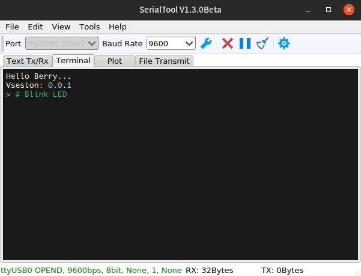

<p align="center">
  <a>
    
  </a>
  <h2 align="center">SerialTool</h2>
  <p align="center">
    <a href="https://github.com/gztss/SerialTool/blob/master/LICENSE">
      
    </a>
    <a href="https://github.com/gztss/SerialTool/issues">
      
    </a>
    <a>
      
    </a>
    <a href="https://github.com/gztss/SerialTool/archive/master.zip">
      
    </a>
    <a href="https://github.com/gztss/SerialTool/releases">
      
    </a>
    <a href="https://github.com/gztss/SerialTool/releases">
      
    </a>
  </p>
  <p align="center">A practical Serial-Port/TCP/UDP debugging tool.</p>
</p>

## 简介

SerialTool 是一个跨平台的串口/网络调试工具。此工具支持串口调试助手、终端、波形显示和文件传输等功能。该工具的源代码使用 GPL3 许可证发布。

SerialTool 支持基础的文本传输。文本传输界面支持 16 进制与 ASCII 格式的收发。您可以自定义文本传输使用的字符编码，目前 SerialTool 支持 ASCII、GB-2312、GB-18030、UTF-8、UTF-16BE、UTF-16LE 共 6 总字符编码。此外还支持多种代码高亮模式，这对文本通信协议（例如使用 JSON 通信）的操作有较大帮助。

SerialTool 的波形显示模块使用简单的协议进行数据传输，我们已经为用户封装好了平台无关的[C语言协议库](./SerialTool/slave)，具体的协议说明请参考[串口示波器协议说明](../../plot_protocol.md)。用户可以将采集的波形保存为文本文件，然后使用 Matlab 等工具进行数据分析（您需要自己编写程序，SerialTool 的波形存档为 csv 格式）。当然，您也可以使用 SerialTool 载入波形文件。

如果您支持本软件，欢迎贡献源代码或者向作者提出建议。

## 重要信息

作者目前已经不再维护该项目，如果用户有问题建议自行修改代码解决或者使用其他工具代替。如果无法解决也可以联系作者。感谢您对 SerialTool 的支持！

## 演示

<p align="center">

</p>

这是使用 SerialTool 的终端功能（还在开发中）与烧录了 [Berry](https://github.com/gztss/berry) 脚本语言固件的 STM32F103 单片机交互的例子。您可以根据需要定义自己的语法高亮配置文件而不需要修改 C++ 代码。

## 特性

* 使用 Qt 开发，跨平台。目前支持 Windows 和 Linux
* 中文接收显示不乱码
* 国际化支持
* 换肤
* 波形显示默认最多支持 16 通道，也可以重新编译支持更多通道
* 波形数据保存（纯文本，csv 格式）与读取
* 波形数据支持时间戳。时间戳包括年、月、日、时、分、秒、毫秒、采样率，方便进行波形数据分析（时间戳由下位机发送）
* 文本收发界面支持语法高亮(Bash, JSON, Lua, C/C++ 等)
* 文本收发界面支持多种字符编码，如 GB2312, UTF8, UTF16 等
* 通信接口支持 TCP/UDP 和串口
* 支持文件传输(目前只支持 XModem 协议)

## [查看Wiki](../../wiki)

## 下载地址

* [Latest release](https://github.com/gztss/SerialTool/releases/latest)
* [GitHub](https://github.com/Le-Seul/SerialTool/releases)
* [百度网盘](http://pan.baidu.com/s/1c18ZXW8) (不推荐😂😂)

## 项目信息

* 下位机示例代码在[./SerialTool/slave](./SerialTool/slave)目录下，该目录有两个文件：
  * [sendwave.c](./SerialTool/slave/sendwave.c)
  * [sendwave.h](./SerialTool/slave/sendwave.h)
  * 您可以参考[串口示波器协议说明](../../plot_protocol.md)来了解下位机该如何发送波形数据。
* 跟随本项目发布的 Windows 32 位安装包使用 Qt 5.6.3 for MinGW 编译。
* 使用的插件:
  * qscintilla-qt5: [Documentation](http://pyqt.sourceforge.net/Docs/QScintilla2), [Download](https://riverbankcomputing.com/software/qscintilla/download)
  * qt5-charts: 此插件在 Qt 5.7 以及更高的版本中包含在Qt安装文件中，使用 Qt 5.6 时需要自行编译。
  * qt5-scripts: Qt 5自带 Qt Scripts，安装时勾选即可。
  * qt5-serialport: Qt5 串口
  * qt5-tools: Qt5 工具

## 构建

### 安装 Qt 开发工具

1. 到[这里](http://download.qt.io/archive/qt/)下载你需要的Qt版本。注意在 Qt5.7 之前你需要自行编译 Qt Charts 模块。
2. 运行下载的Qt安装文件。在Windows下直接双击即可，Linux下需要给安装文件加上可执行权限。然后根据需要配置Qt，直到“选择组件 (Select Components)”界面。
3. 在“选择组件 (Select Components)”界面的Qt选项下需要勾选一个 Qt 主模块（例如MinGW 7.3.0 64-bit、MSVC 2017 64-bit等），此外还要勾选 Qt Charts 模块和 Qt Script 模块。如果你的系统中没有安装需要的编译器，你还要在Tools选项下中勾选需要的编译器（如MinGW 7.3.0 64bit）。
4. 根据提示安装Qt。如果需要的话你可以为Qt设置环境变量。

### 安装 QScintilla

1. 下载 [QScintilla](https://riverbankcomputing.com/software/qscintilla/download) 源码并解压缩。
2. 在 Windows 下，打开 *“开始菜单 -> 程序列表 -> Qt 5.12.0 -> Qt 5.12.0 for Desktop (MinGW 7.3.0 64-bit)”*。Linux 下直接打开终端即可（需要[设置 Qt 的环境变量](https://www.linuxprobe.com/linux-qt.html)）。
3. 打开 QScintilla_gpl-2.10.8/Qt4Qt5 文件夹。具体操作为：
   * 假设 Windows 下路径为 "C:\QScintilla_gpl-2.10.8\Qt4Qt5"，执行操作
     ``` cmd
     cd C:\QScintilla_gpl-2.10.8\Qt4Qt5
     qmake
     mingw32-make
     mingw32-make install
     qmake CONFIG+=debug
     mingw32-make
     mingw32-make install
     ```
   * 假设 Linux 下路径为 "~/QScintilla_gpl-2.10.8/Qt4Qt5" 则执行操作
     ``` bash
     cd ~/QScintilla_gpl-2.10.8/Qt4Qt5
     qmake
     make
     make install
     ```

### 编译 SerialTool

1. 使用 Qt Creator 打开 "SerialTool/SerialTool/SerialTool.pro" 文件。
2. 在 Qt Creator 右下角选择配置为 Release（可选）。
3. 编译项目。

### Linux 需要安装的依赖包

- Arch Linux 及其衍生版

```bash
yay -S qscintilla-qt5 qt5-serialport qt5-charts qt5-script qt5-tools
```

- Ubuntu Linux 及其衍生版

```bash
sudo apt install qscintilla-qt5 qt5-serialport qt5-charts qt5-script qt5-tools
```

### Arch Linux 安装 SerialTool

```bash
yay -S serialtool
# or:
yay -S serialtool-git
```

## 交流

QQ群：961508887

当然，有问题的建议发[issue](https://github.com/gztss/SerialTool/issues)。

## 开源协议

本程序遵从[GPL-3.0协议](./LICENSE)发布，[./SerialTool/slave](./SerialTool/slave)目录下的源码不受 GPL-3.0 协议约束，用户可以将这些代码加入到自己的项目中而不必公开。

[License](./LICENSE)
